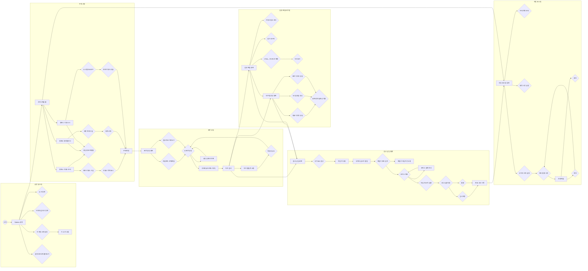

```mermaid
flowchart LR

  subgraph s1 ["설정 및 인증"]
    n1(("시작"))
    n2["Options 설정"]
    n3{"AI 키 등록"}
    n4{"이미지/검색 키 등록"}
    n5{"키 자동 순환 설정"}
    n6{"설정 내보내기/불러오기"}
    n7["키 소진 오류"]
  end

  subgraph s2 ["주제 선정"]
    n8["사이드패널 홈"]
    n9["경로A: 키워드 분석"]
    n10{"연관 키워드 수집"}
    n11{"키워드 목록 표시"}
    n12["경로B: 경쟁 블로그"]
    n13{"제목 목록 수집"}
    n14{"제목 선택"}
    n15["경로C: 다중 소스"]
    n16{"소스별 ON/OFF"}
    n17{"연관 키워드 추출"}
    n18{"수집 중단/진행률"}
    n19["주제 확정"]
  end

  subgraph s3 ["본문 생성"]
    n20["본문 생성 화면"]
    n21{"프롬프트 선택/편집"}
    n22{"참고자료 가져오기"}
    n23{"AI 본문 생성"}
    n24["후처리(코드펜스 제거)"]
    n25["마커 검사"]
    n26["마커 불일치 오류"]
    n27{"재생성 유도"}
    n28["생성 실패/키 전환"]
  end

  subgraph s4 ["검증·편집·비주얼"]
    n29["검증·편집 화면"]
    n30{"키워드 밀도 분석"}
    n31{"찾기·바꾸기"}
    n32{"HTML↔마크다운 변환"}
    n33{"미리보기"}
    n34["비주얼 생성 화면"]
    n35{"대표 이미지 생성"}
    n36{"H2 썸네일 생성"}
    n37{"본문 이미지 생성"}
    n38{"중복 회피/일관성 적용"}
  end

  subgraph s5 ["합성·삽입·발행"]
    n39["합성·삽입 화면"]
    n40{"부가요소 합성"}
    n41["작업 큐 생성"]
    n42["네이버 글쓰기 팝업"]
    n43{"편집기 준비 감지"}
    n44["편집기 타임아웃 오류"]
    n45{"포커스 확보"}
    n46["포커스 실패 안내"]
    n47{"작업 큐 순차 실행"}
    n48{"서식 일괄 적용"}
    n49{"임시저장"}
    n50{"발행"}
    n51["완료 신호 기록"]
  end

  subgraph s6 ["자동 포스팅"]
    n52["자동 포스팅 화면"]
    n53{"주제 목록 관리"}
    n54{"예약 시각 설정"}
    n55{"무작위 간격 설정"}
    n56{"연속 발행 시작"}
    n57["진행 패널"]
    n58{"중단"}
    n59{"재개"}
  end

  n1 --> n2
  n2 --> n3
  n2 --> n4
  n2 --> n5
  n2 --> n6
  n5 --> n7
  n2 --> n8
  n8 --> n9
  n9 --> n10
  n10 --> n11
  n11 --> n19
  n8 --> n12
  n12 --> n13
  n13 --> n14
  n14 --> n19
  n8 --> n15
  n15 --> n16
  n16 --> n17
  n17 --> n19
  n9 --> n18
  n12 --> n18
  n15 --> n18
  n19 --> n20
  n20 --> n21
  n20 --> n22
  n21 --> n23
  n22 --> n23
  n23 --> n24
  n24 --> n25
  n25 --> n26
  n26 --> n27
  n27 --> n23
  n23 --> n28
  n28 --> n23
  n25 --> n29
  n29 --> n30
  n29 --> n31
  n29 --> n32
  n32 --> n33
  n29 --> n34
  n25 --> n34
  n34 --> n35
  n34 --> n36
  n34 --> n37
  n35 --> n38
  n36 --> n38
  n37 --> n38
  n34 --> n39
  n29 --> n39
  n25 --> n39
  n39 --> n40
  n40 --> n41
  n41 --> n42
  n42 --> n43
  n43 --> n44
  n43 --> n45
  n45 --> n46
  n46 --> n45
  n45 --> n47
  n47 --> n48
  n48 --> n49
  n48 --> n50
  n49 --> n51
  n50 --> n51
  n51 --> n52
  n52 --> n53
  n52 --> n54
  n52 --> n55
  n55 --> n56
  n56 --> n57
  n57 --> n58
  n57 --> n59
  n59 --> n56
  n8 --> n52
```
